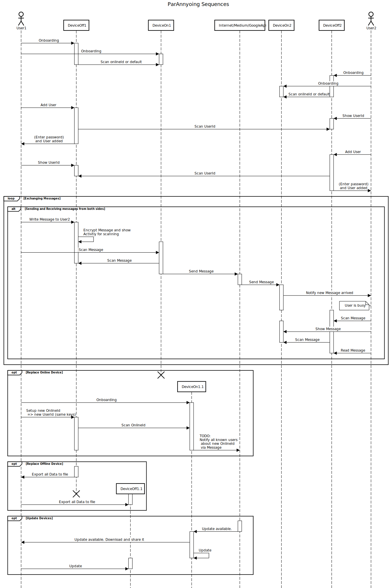

# Parannyoing Whitepaper

## Abstract

Die Anwendung hat das Ziel die sicherste Mobile App zu werden. Dabei wird auf gute User Experience verzichtet. Ein großes Augenmerk soll auch die Sicherung gegen Trojaner und andere Überwachungsmittel gelegt werden, denn dies ist nur mit großen Abstrichen gegen die UX möglich.
Als Kerngedanke dient hier das Kerkshoffsche Prinzip, die geheim Haltung der Schlüssel, nicht des Verfahrens.
Um die Informationen geheim zu halten wird es daher Untersagt kritische Verbindungen mit anderen Geräten aufzunehmen.

// TODO: Das meiste ist längst veraltet und muss überarbeitet werden 26.07.2023

## TODO: Proof concepts
- Ist Entschlüsseln ohne Hinweis auf NutzerId eine potentielle Backdoor um Trojaner zu bekommen
    => Daten so erstellt, dass entschlüsseln dazu führt das Code ausgeführt wird, hypothese ist nein, denn es werden nur String/ Verschlüsselungsoperationen ausgeführt
- Ist es wirklich sinnvoll alle Metadaten nicht einfach per JSON zu verschlüsseln
    => Sorgt für obfusication aber öffnet ggf. auch Türen..

## Inhaltsverzeichnis
// TODO

## Zielsystem
Aktuell nur Android.

## Grundlegender Architektur
Online Offline gerät

## Verbindungstypen
### Internet
#### Versenden von Nachrichten
Via Googles Api oder einem beliebigen Messenger (WhatsApp, Briar) bzw. Kanal. Sicherheit des Kanals egal, da Nachricht sicher verschlüsselt.
#### Updaten der App
Manuelles herunterladen der App über das Online Gerät
### Computer
Übertragung von Backups
### Bluetooth / NFC
Austausch von Nachrichten
### Kamera
Austausch von Nachrichten und UserIds
## Sicherheitsmechanismen
### Schlüsselaustauschverfahren
UserId enthält asymmetrischen Schlüssel, symmetrischer Schlüssel wird durch Kombination mehrerer UserIds erzeugt
=> Zu untersuchern ist ob Symmetrischer Schlüssel reverse reverse engineered werden kann und damit auch der public key ermittelt werden kann
### Verschlüsselung
3 Layer: Hardware, Symmetrisch & Asymmetrisch.
 Zukünftig:
- vermutlich Quanten Sichere Implementierungen
- unterschiedliche Verfahren auf Basis von Nutzerdaten
### HMAC / Identifizierungsmechanismen
### Network Checker
### Computer Checker
### Root Checker
### Hardware Encryption
Ein Hinweis beim Starten
### Datenbank Zugriffsrechte
### Bildschirmschoner
### Pinlock
## Angriffspunkte
### Update Prozess: Man in the Middle
Durch falsches weiterleiten durch ein Gateway kann Schadsoftware auf das Offline-Gerät kommen, die es ermöglicht Schadhafte Verbindungen aufzubauen oder einen der Checker zu disablen.

### Bruteforce
Durch Hardwareverschlüsselung ist kein simples raten der Schlüssel möglich. Hierfür müsste in einem ersten Schritt die App dekompiliert werden und an passenden Stellen der Keygenerator injeziert werden. Zudem ist dieser Algorithmus auf Android Geräte ausgelegt, dadurch entsteht entweder Portierungsaufwand auf performantere Systeme oder performance Einbußen.

Aktuell steht ein Token System, dass die Schlüssel von Zeit zu Zeit beeinflusst, noch aus. Sollte ein Schlüssel also einmal einem Angreifer in die Hände fallen, wäre die Sicherheit gefährdet.
An dieser Stelle noch der Hinweis das eine UserId nicht ausreicht
### Lesen der Entschlüsselten Nachrichten
Zu gewissen Zeitpunkten existiert die Nachricht entschlüsselt im Speicher. Auf gerooteten Systemen lässt sich dieser leicht auslesen und leider nicht immer erkennen das diese es sind. Dies ist auch der Weg wie Regierungen E2E-Verschlüsselung knacken (vgl. Bundestrojaner), mittels Trojaner mit Root rechten werden die Nachrichten gelesen und weitergeleitet. Hierzu wurden die Checker implementiert diese können allerdings nicht akkurat genug reagieren. Bis die App benachrichtigt wurde das eine aktive Verbindung besteht könnten bereits Daten gesammelt worden sein und nachstehend versendet werden.  Das löschen der Daten ist nicht ausreichend, ein Kill Switch aber nur über User Interaktion möglich via Factory Resets.

### Denial Of Service
Die App Kommuniziert für ein bisschen UX über Firebase Realtime api, dieser Service ist nur begrenzt kostenlos Nutzbar. Mit ca. 1000 Nachrichten im Monat wird der kostenlose Service gesperrt, die Nutzung eines kostenbasierten Services würde diese Attacke höchst gefährlich machen und Wartungsaufwand für Nutzer oder sogar IP-Sperren erzeugen. Somit können auch Nutzer nicht von Nachrichten überflutet werden und somit echte Nachrichten untergehen. Eine weiter Hürde wäre hier auch das ermitteln der NutzerId da diese nicht mit Persönlichen-Daten verbunden ist.
Als gängige Alternative kann jedes beliebige Medium genutzt werden. So können die Nachrichten über WhatsApp, Email oder im idealfall über TOR mittels Briar die Nachrichten übertragen werden. Es können nicht alle Kanäle geflutet werden und müssen erst recht durch den Nutzer in die App übertragen werden, dadurch ist eine totale DOS direkt die App betreffend ausgeschlossen. Möglich hingegen natürlich durch das Fluten eines Kanals das fehlende erreichen einer Nachricht des Ziels.

### Einsicht (TODO: besseren Namen finden)
Das lesen seiner privaten Nachrichten erfolgt selbstverständlich im Klartext, wenn eine Kamera nun auf das Display eines offline Gerätes gerichtet ist können die Nachrichten gelesen werden.
Damit unbeaufsichtigte Geräte vor Kameras geschützt sind wurde ein Screensaver implementiert der bei Nutzerinteraktion das Bild verwischt, zukünftig ist hier eine erweiterung durch Gesichtserkennung geplant sodass nur einzelne Nutzer das Gerät betrachten können. Zudem ist das dedizierte Pinschloss  mit 7 Ziffern ein Schutz vor langwierigen Zugriffszeiten.
Im FAQ wird der Nutzer noch angeregt seine Texte mit dem Partner mit Schlüsselwörtern zu versehen z.B. das Wort Käse durch Bier zu ersetzen. Von einer manuellen Anwendung der Cäser-Chiffre oder anderer komplexerer Verschlüsselung wird abgeraten, da dabei meist Klartextschriften verfasst werden.
### Sicherheit der Channel
Da Kamera Kommunikation über QrCodes unidirectional sind hat der Nutzer die volle Kontrolle über die übertragenen Daten. Bei NFC und Bluetooth sieht das anders aus, NFC bildet ein geringeres Risiko das das Protokoll nur geringe Datenmengen zulässt. Bluetooth hingegen kann ähnliche Risiken birgen wie eine aktive Internet Verbindung. Bspw. kann durch Stagefright auf verschiedensten Android Versionen Kontrolle über ein fremdes Gerät erlangt werden.
Im Worst Case sind sogar bereits beide Geräte mit einem Trojaner infiziert und können beliebige Daten austauschen.

### Zugriff auf Backupdaten
Wenn Nutzer ein neues offline Gerät benötigen kann über die Einstellungen ein Backup aller aktuellen Daten (Nachrichten, Schlüssel, Einstellungen) erstellt werden, diese müssen dann manuell auf das neue Gerät transferiert werden. Diese Daten können nicht sonderlich gut Geschützt werden, da der Nutzer den Schlüssel nicht persistieren sollte, vor allem nicht Digital und somit nur eine beschränkte Zeichenkette als Schlüssel dient.
Zukünftig soll hier eine ähnliche Verschlüsselung wie bei den Nachrichten erfolgen, dabei soll ein großer Schlüssel getrennt von der Datei über einen beliebigen Kanal, die Datei wenn möglich per SD Karte und ein kleiner Schlüssel als Passwort vom Nutzer behalten werden.

### Crashreports
Crashreports werden zurzeit unverschlüsselt, wegen von Funktionalitäts- und Dateneinschränkung, an einen dritten Hoster weitergeleitet und verweilen für ca 1 Monat dort.  
Crashreports eines offline Gerätes müssen vom User aktiv an das Online Gerät übertragen werden. Zudem enthalten sie keine sensiblen bzw. nutzerbezogene Daten. Informationen sind bspw. Stacktrace, Android- & Appversion, Gerätename etc.  
Höchstens interessant um mögliche Schwachstellen der Channels bzw. Bluetooth/ NFC Verbindung zu ermitteln.

